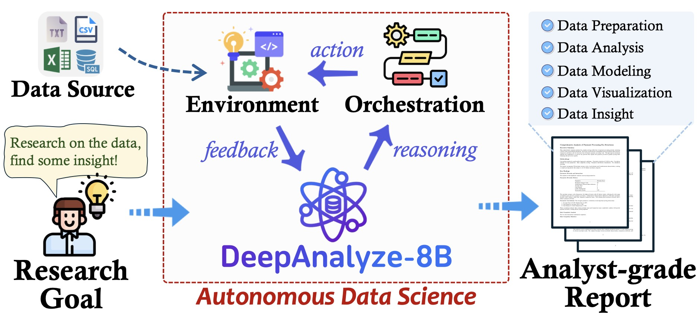
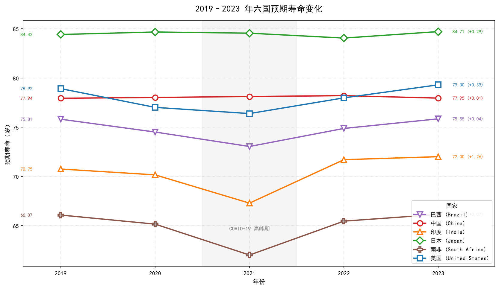
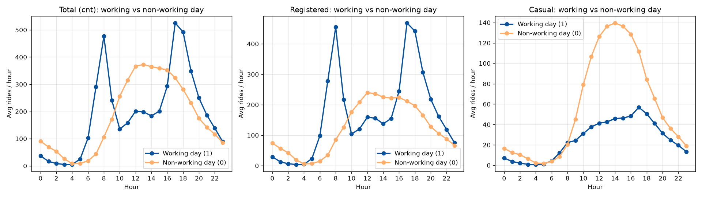
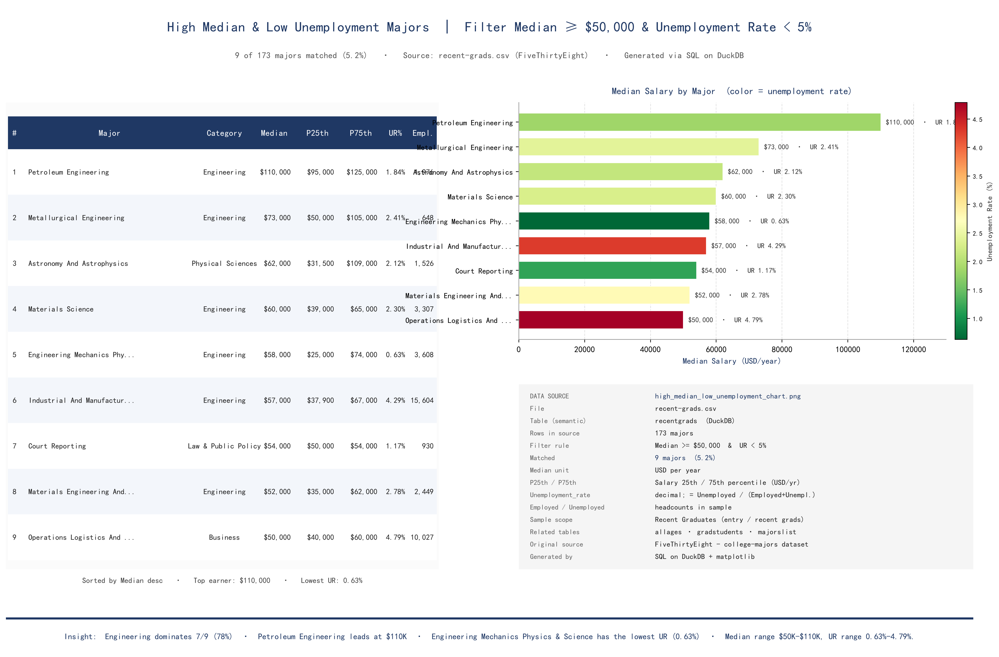
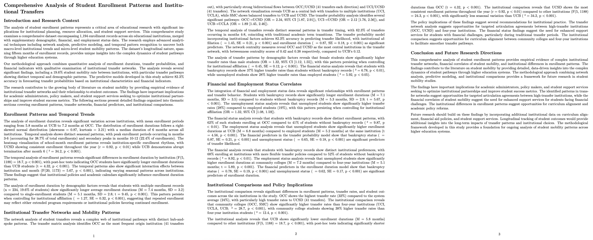

# DataAI

**Language:** English | [简体中文](README_ZH.md)

## English Overview

> **A local, governed workspace for conversational data analysis**

DataAI combines DeepAnalyze’s autonomous data-science capabilities with WrenAI’s semantic layer and text-to-SQL workflow in one local environment. Users can ask questions in natural language and move from data querying and exploration to code execution, visualization, and report generation. Accounts, sessions, and model settings are persisted with per-user isolation.

This repository brings together three components to provide an end-to-end workflow from natural-language questions to reproducible analytical results:

- **[DeepAnalyze](https://github.com/ruc-datalab/DeepAnalyze)** — RUC-DataLab’s open-source autonomous data-science agent ([paper](https://arxiv.org/abs/2510.16872) / [model](https://huggingface.co/RUC-DataLab/DeepAnalyze-8B)) for automated data exploration, code execution, visualization, and report generation.
- **[WrenAI](https://github.com/Canner/WrenAI)** — Canner’s open-source GenBI engine, providing governed text-to-SQL and a semantic layer (MDL). Its upstream source is included under **`WrenAI/`** for local reference, integration, and Wren CLI builds.
- **Core workspace** — `DeepAnalyze/demo/chat_v2/`, an out-of-the-box conversational analytics application that connects DeepAnalyze and WrenAI with user authentication, isolated sessions, automatic semantic-layer construction, sandboxed code execution, and persistent model settings.

Supported sources include CSV, Excel, and SQLite files uploaded within a session. DataAI automatically builds DuckDB and a dynamic MDL, exposes them through the WrenAI semantic layer, and enables governed SQL queries through the injected `wren_query()` function.

***

  

## ✨ Highlights

1. **One prompt, full pipeline** — Upload a file, describe your goal in plain language, and the Agent writes Python/SQL, executes it, and produces charts and reports. No code, no SQL, no DuckDB knowledge required.
2. **Governed semantic layer (WrenAI)** — Each uploaded file auto-generates an MDL with column types, inferred PK/FK relations, and column meanings. All queries go through the semantic layer, catching the most common LLM mistakes (wrong columns, drifted joins, inconsistent metrics) before they happen.
3. **Real results, not mockups** — Every chart below was generated by the Agent running real Python in real sessions.

| Six-country life expectancy (2019-2023) | Working-day vs non-working-day bike sharing | US college majors with high median & low unemployment |
| :---: | :---: | :---: |
|  |  |  |
| *"2019-2023 life expectancy change and recovery across six countries (China, US, India, Japan, Brazil, South Africa)"* | *"Working-day vs non-working-day peak hours and 24h usage patterns"* | *"Find majors with median ≥ 50000 and unemployment rate < 0.05"* |

4. **Multi-user isolation + cross-session recall** — Accounts, sessions, and history are strictly per-user (path: `workspace/u<user>__...`). The same user's different sessions share a personal **query memory**: a successful NL→SQL pair from one session is automatically recalled in future sessions to avoid repeated trial-and-error.
5. **Sandboxed execution** — Default Docker sandbox (file-size limits, optional network). Local mode available for development. Per-step timeout 120s, max 12 rounds / 15 minutes per session.
6. **Analyst-grade reports** — One-click export to **PDF** (via Pandoc + xelatex) and **Markdown**, with charts, tables, code, and interpretation baked in.

  

***
